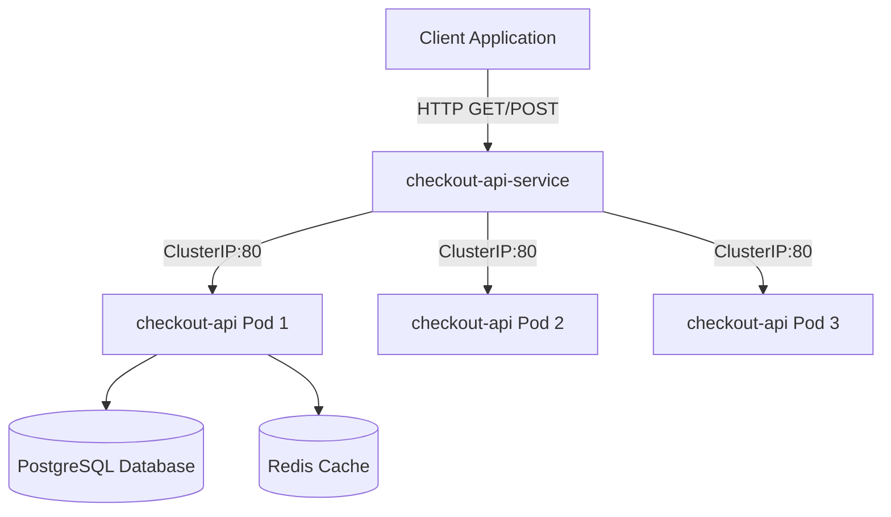

# Checkout API Service Architecture

The Checkout API is a critical component of our e-commerce platform. It handles cart processing, discount calculation, and initiates payment gateway requests.

## Component Overview

## System Requirements

- **Python Version**: 3.11
- **Primary Framework**: Flask 3.0.2
- **Production Server**: Gunicorn 22.0.0
- **External Dependencies**:
  - PostgreSQL (via `DATABASE_URL` environment variable)
  - Redis (via `REDIS_URL` environment variable)

## Operational Settings

The application reads configurations from the environment:
- `PORT`: Server port (default: 5000)
- `LOG_LEVEL`: Log level (e.g., debug, info, warning, error)
- `DATABASE_URL`: Connection string to PostgreSQL
- `REDIS_URL`: Connection string to Redis Cache

## Release History

| Version | Release Date | Author | Deployment Status | Notes |
|---------|--------------|--------|-------------------|-------|
| v2.0 | 2026-04-10 | Dev Team | Deployed (Prod) | Initial Flask conversion |
| v2.1 | 2026-05-02 | Dev Team | Deployed (Prod) | Add health checks, fix cache bugs |
| v2.2 | 2026-05-20 | Dev Team | Deployed (Prod) | Optimize database pool sizes |
| v2.3 | 2026-06-01 | Dev Team | Deployed (Prod - STABLE) | Current production release |
| v2.4 | 2026-06-17 | Dev Team | Release Candidate | Contains minor performance improvements for checkouts |
