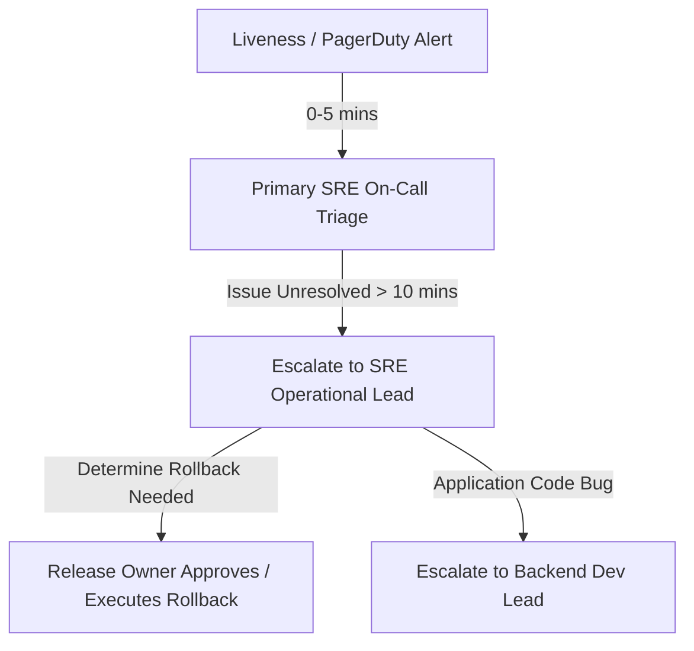

# Deployment Ownership & Escalation Plan

To ensure operational readiness and accountability, this document defines key roles, on-call assignments, and escalation paths during the Checkout API v2.4 deployment window.

## 1. Deployment Roles & Responsibilities

| Role | Assignee | Contact Details | Key Responsibilities |
|---|---|---|---|
| **Release Owner** | SRE Lead / Release Engineer | `sre-release-owner@company.com` | Oversees deployment execution, triggers rollback if needed, and signs off. |
| **SRE Operational Lead** | SRE Infrastructure Architect | `sre-ops-lead@company.com` | Monitors Kubernetes metrics, verifies log ingestion, and checks DB pools. |
| **On-Call Support** | Primary SRE On-Call | Slack: `#sre-oncall` | Handles primary triage of liveness/readiness alarms. |
| **Dev Escalation Lead** | Backend Checkout Tech Lead | `checkout-dev-lead@company.com` | Escalation point for application errors, bugs, or schema mismatches. |

---

## 2. Escalation Matrix & SLA

During the deployment window (and the 2-hour monitoring window following deployment), the following SLA response times apply:

- **P1 Severity (Checkout Failures, Crash Loop)**:
  - Triage Time: `< 5 minutes`
  - Rollback Decision Window: `< 10 minutes`
- **P2 Severity (Redis cache fallback, Warning Logs)**:
  - Triage Time: `< 15 minutes`
  - Mitigation Window: `< 30 minutes`
